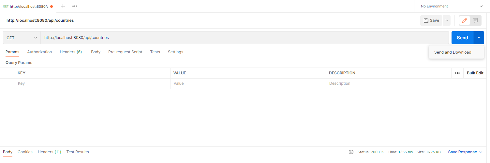

# RestCountries-Node
## Consuming RestCountries API and Exceljs

To execute project Run

```
  npm install
  npm start
```
it will run in your local machine
in .env file can you change where the excel file will be saved in your project, Project Port where it will run And API URI where the API get countries data
**I recommend to mantain the default value**

```
PORT=8080
EXCEL_PATH= ./src/temp/countries.xlsx
BASE_URI=https:https://restcountries.com/v2
```

to get excel, open your browser and paste this link, if you change the port in *.env file*, change it in url too
```
  http://localhost:8080/api/countries
```
or open **Postman** and click in ***SEND AND DOWNLOAD*** d with the url pasted and method setted to ***GET***


